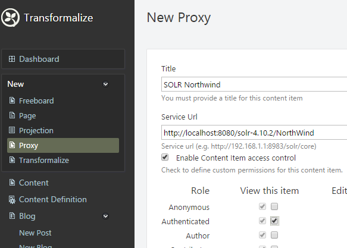
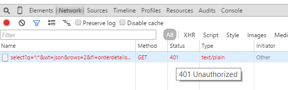

Proxy
=====

This is an Orchard CMS 1.8.1 module for securing 
private (or just internal) resources.  It is 
released under the Apache 2 license.

---

Out of the box, this module handles GET and POST 
requests.

####SOLR Example

Once you have [SOLR](http://lucene.apache.org/solr/) instance up and running, you can query 
it directly.  Here's a GET request you could call in your web browser:

<pre class="prettyprint" lang="bash">
http://localhost:8080/solr-4.10.2/NorthWind/select?q=*:*&wt=json&rows=2&fl=orderdetailsorderid,ordersorderdate,ordersfreight,productsunitprice,productsproductname,productsdiscontinued
</pre>

It returns a response like this:

<pre class="prettyprint" lang="js">
{
  &quot;responseHeader&quot;:{
    &quot;status&quot;:0,
    &quot;QTime&quot;:2,
    &quot;params&quot;:{
      &quot;q&quot;:&quot;*:*&quot;,
      &quot;indent&quot;:&quot;true&quot;,
      &quot;fl&quot;:&quot;orderdetailsorderid,ordersorderdate,ordersfreight,productsunitprice,productsproductname,productsdiscontinued&quot;,
      &quot;rows&quot;:&quot;2&quot;,
      &quot;wt&quot;:&quot;json&quot;}},
  &quot;response&quot;:{&quot;numFound&quot;:2157,&quot;start&quot;:0,&quot;docs&quot;:[
      {
        &quot;ordersorderdate&quot;:&quot;1996-07-19T04:00:00Z&quot;,
        &quot;orderdetailsorderid&quot;:10261,
        &quot;ordersfreight&quot;:3.05,
        &quot;productsunitprice&quot;:10.0,
        &quot;productsproductname&quot;:&quot;Sir Rodney&#39;s Scones&quot;,
        &quot;productsdiscontinued&quot;:false},
      {
        &quot;ordersorderdate&quot;:&quot;1996-07-19T04:00:00Z&quot;,
        &quot;orderdetailsorderid&quot;:10260,
        &quot;ordersfreight&quot;:55.09,
        &quot;productsunitprice&quot;:15.0,
        &quot;productsproductname&quot;:&quot;Outback Lager&quot;,
        &quot;productsdiscontinued&quot;:false}]
  }}
</pre>

You could grab a javascript library like [ajax-solr](https://github.com/evolvingweb/ajax-solr/wiki) 
and start searching on your website.  One problem though, you 
probably shouldn't expose your SOLR instance to _the entire world_.

####Securing SOLR

You can secure it by creating a proxy for it with this module.

Enable _Content Item Permissions_, check `Authenticated`, and save it.  Then, you should see it in your content items:

Now, instead of accessing SOLR directly, you can access it 
through your proxy:

<pre class="prettyprint" lang="bash">
http://<strong>www.YourOrchardCms.com</strong>/Proxy/8090/select?q=*:*&wt=json&rows=2&fl=orderdetailsorderid,ordersorderdate,ordersfreight,productsunitprice,productsproductname,productsdiscontinued
</pre>

Orchard's _Content Item Permission_ is only allowing 
authenticated users access to it.  If I logout and try to access 
it, it will give me a [401](http://www.w3.org/Protocols/rfc2616/rfc2616-sec10.html#sec10.4.2):

###Advanced

So far, I've found two situations that require _web.config_ 
changes.

1. resource requires `PUT` and/or `DELETE` methods
2. resource uses funny characters on the request path

#####Allow PUT, and DELETE

Unfortunately, an IIS [WebDAV](http://en.wikipedia.org/wiki/WebDAV) 
module and handler interfer with `PUT`, and `DELETE` requests.

So, if you want to allow `PUT` and `DELETE` through 
your proxy, you have to opt-out of WebDAV. This is done 
by modifying Orchard's _web.config_.

<pre class="prettyprint" lang="xml">
&lt;modules&gt;
    ...
    &lt;remove name=&quot;WebDAVModule&quot;/&gt;
&lt;/modules&gt;
</pre>

<pre class="prettyprint" lang="xml">
&lt;handlers&gt;
    ...
    &lt;remove name=&quot;WebDAV&quot;/&gt;
&lt;/handlers&gt;
</pre>

#####Allow Characters in Request Path

By default, ASP.NET considers some characters in a request 
path to be invalid. These characters are `<`, `>`, `*`, `%`, `:`, and `&`.

If your proxied resource relies on any of these 
characters, you may need to edit `requestPathInvalidCharacters` 
in `httpRuntime`.

The example below has the default invalid characters, 
minus the `*` character.

<pre class="prettyprint" lang="xml">
&lt;system.web&gt;
    &lt;httpRuntime ... requestPathInvalidCharacters=&quot;&amp;lt;,&amp;gt;,%,:,&amp;amp;&quot; /&gt;
&lt;/system.web&gt;
</pre>