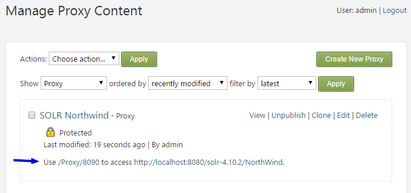

(Reverse) Proxy
=====

This is an Orchard CMS 1.10 module for securing 
private (or just internal) resources.  It is 
released under the Apache 2 license.

---

#### SOLR Example

If you have [SOLR](http://lucene.apache.org/solr/) instance up and running, you can query it directly.  Here's a url in your web browser:

```
http://localhost:8993/solr/NorthWind/select?q=*:*&wt=json&rows=2&fl=orderdetailsorderid,ordersorderdate,ordersfreight,productsunitprice,productsproductname,productsdiscontinued
```

It returns a response like this:

```json
{
  "responseHeader":{
    "status":0,
    "QTime":2,
    "params":{
      "q":"*:*",
      "indent":"true",
      "fl":"orderdetailsorderid,ordersorderdate,ordersfreight,productsunitprice,productsproductname,productsdiscontinued",
      "rows":"2",
      "wt":"json"}},
  "response":{"numFound":2157,"start":0,"docs":[
      {
        "ordersorderdate":"1996-07-19T04:00:00Z",
        "orderdetailsorderid":10261,
        "ordersfreight":3.05,
        "productsunitprice":10.0,
        "productsproductname":"Sir Rodney's Scones",
        "productsdiscontinued":false},
      {
        "ordersorderdate":"1996-07-19T04:00:00Z",
        "orderdetailsorderid":10260,
        "ordersfreight":55.09,
        "productsunitprice":15.0,
        "productsproductname":"Outback Lager",
        "productsdiscontinued":false}]
  }}
```

You can use it from the server on your website safely, but your client-side script would not be able to use it unless you exposed your SOLR instance to _the entire world_.

#### Securing SOLR

You can secure it by creating a reverse proxy for it with this module.


Enable _Content Item Permissions_, check `Authenticated`, and save it.  Then, you should see it in your content items:



Now, instead of accessing SOLR directly, you can access it 
through your proxy:

<pre class="prettyprint" lang="bash">
http://<strong>www.YourOrchardCms.com</strong>/Proxy/8090/select?q=*:*&wt=json&rows=2&fl=orderdetailsorderid,ordersorderdate,ordersfreight,productsunitprice,productsproductname,productsdiscontinued
</pre>

Orchard's _Content Item Permission_ is only allowing 
authenticated users access to it.  If I logout and try to access 
it, it will give me a [401](http://www.w3.org/Protocols/rfc2616/rfc2616-sec10.html#sec10.4.2):


### Advanced

So far, I've found two situations that require _web.config_ 
changes.

1. resource requires `PUT` and/or `DELETE` methods
2. resource uses funny characters on the request path

##### Allow PUT, and DELETE

Unfortunately, an IIS [WebDAV](http://en.wikipedia.org/wiki/WebDAV) 
module and handler interfer with `PUT`, and `DELETE` requests.

So, if you want to allow `PUT` and `DELETE` through 
your proxy, you have to opt-out of WebDAV. This is done 
by modifying Orchard's _web.config_.

```xml
<modules>
    <!-- ... -->
    <remove name="WebDAVModule"/>
</modules>
```

```xml
<handlers>
    <!-- ... -->
    <remove name="WebDAV"/>
</handlers>
```

##### Allow Characters in Request Path

By default, ASP.NET considers some characters in a request 
path to be invalid. These characters are `<`, `>`, `*`, `%`, `:`, and `&`.

If your proxied resource relies on any of these 
characters, you may need to edit `requestPathInvalidCharacters` 
in `httpRuntime`.

The example below has the default invalid characters, 
minus the `*` character.

```xml
<system.web>
    <httpRuntime requestPathInvalidCharacters="&lt;,&gt;,%,:,&amp;" />
</system.web>
```